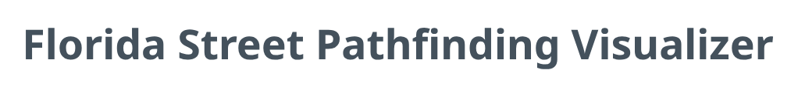

[![Contributors][contributors-shield]][contributors-url]
[![Stargazers][stars-shield]][stars-url]
[![Issues][issues-shield]][issues-url]


<!-- PROJECT LOGO -->
<br />
<div align="center">
  <a href="https://github.com/jacobnickerson/dsa-3">
    
  </a>

<h3 align="center">Florida Pathfinding Visualizer</h3>

  <p align="center">
    Pathfind like never before. Now featuring ~1 million nodes and ~2 million edges.
    <br />
    <br />
    <a href="https://youtu.be/DdmVzqh7g2E">View Demo</a>
    ·
    <a href="https://github.com/jacobnickerson/dsa-3/issues/new?labels=bug&template=bug-report---.md">Report Bug</a>
    ·
    <a href="https://github.com/jacobnickerson/dsa-3/issues/new?labels=enhancement&template=feature-request---.md">Request Feature</a>
  </p>
</div>


<!-- TABLE OF CONTENTS -->
<details>
  <summary>Table of Contents</summary>
  <ol>
    <li>
      <a href="#about-the-project">About The Project</a>
      <ul>
        <li><a href="#built-with">Built With</a></li>
      </ul>
    </li>
    <li>
      <a href="#getting-started">Getting Started</a>
      <ul>
        <li><a href="#prerequisites">Prerequisites</a></li>
        <li><a href="#installation">Installation</a></li>
      </ul>
    </li>
    <li><a href="#acknowledgments">Acknowledgments</a></li>
  </ol>
</details>


<!-- ABOUT THE PROJECT -->
## About The Project

[![Product Name Screen Shot][product-screenshot]](https://google.com)


<p align="right">(<a href="#readme-top">back to top</a>)</p>


### Built With

* [![React][React.js]][React-url]

<p align="right">(<a href="#readme-top">back to top</a>)</p>


<!-- GETTING STARTED -->
## Getting Started

Installation is seamless and easy using `npm`.

### Prerequisites
* npm
  ```sh
  npm install npm@latest -g
  ```

### Installation


1. Clone the repo
   ```sh
   git clone git@github.com:jacobnickerson/dsa-3.git
   ```
2. Move to `frontend` which really shouldn't exist
   ```sh
   cd frontend
   ```
3. Install NPM packages
   ```sh
   npm install
   ```
4. Download the graph data file (it's too big for GitHub!) and put it in `frontend/public`
   ```
   https://drive.google.com/file/d/1a9LGhOj3UoYXG5edwWQL9wM-8ihfk8YS/view?usp=sharing
   ```
     
6. Run a local dev server to check out the project
   ```
   npm run dev
   ```
<p align="right">(<a href="#readme-top">back to top</a>)</p>


<!-- USAGE EXAMPLES -->
## Usage

It kinda speaks for itself. Check out the demo!

<p align="right">(<a href="#readme-top">back to top</a>)</p>


<!-- ROADMAP -->
## Roadmap

- [x] Finish it on time

<p align="right">(<a href="#readme-top">back to top</a>)</p>


<!-- CONTRIBUTING -->
## Contributing

This is a school project, so you can't really contribute. Sorry.

<p align="right">(<a href="#readme-top">back to top</a>)</p>

### Top contributors:

<a href="https://github.com/jacobnickerson/dsa-3/graphs/contributors">
  
</a>


<!-- LICENSE -->
## License

Distributed under no license. I hope none of those JS libraries had licenses!

<p align="right">(<a href="#readme-top">back to top</a>)</p>


<!-- CONTACT -->
## Contact

Project Link: [https://github.com/jacobnickerson/dsa-3](https://github.com/jacobnickerson/dsa-3)

<p align="right">(<a href="#readme-top">back to top</a>)</p>


<!-- ACKNOWLEDGMENTS -->
## Acknowledgments
Authors
* [Jacob Nickerson](https://github.com/jacobnickerson)
* [Anna Vo](https://github.com/AnnaVo0)
* [Aya Ba Alawi](https://github.com/ayabaalawi)

<p align="right">(<a href="#readme-top">back to top</a>)</p>


<!-- MARKDOWN LINKS & IMAGES -->
<!-- https://www.markdownguide.org/basic-syntax/#reference-style-links -->
[contributors-shield]: https://img.shields.io/github/contributors/jacobnickerson/dsa-3.svg?style=for-the-badge
[contributors-url]: https://github.com/jacobnickerson/dsa-3/graphs/contributors
[forks-shield]: https://img.shields.io/github/forks/jacobnickerson/dsa-3.svg?style=for-the-badge
[forks-url]: https://github.com/jacobnickerson/dsa-3/network/members
[stars-shield]: https://img.shields.io/github/stars/jacobnickerson/dsa-3.svg?style=for-the-badge
[stars-url]: https://github.com/jacobnickerson/dsa-3/stargazers
[issues-shield]: https://img.shields.io/github/issues/jacobnickerson/dsa-3.svg?style=for-the-badge
[issues-url]: https://github.com/jacobnickerson/dsa-3/issues
[product-screenshot]: images/screenshot.png
[React.js]: https://img.shields.io/badge/React-20232A?style=for-the-badge&logo=react&logoColor=61DAFB
[React-url]: https://reactjs.org/
